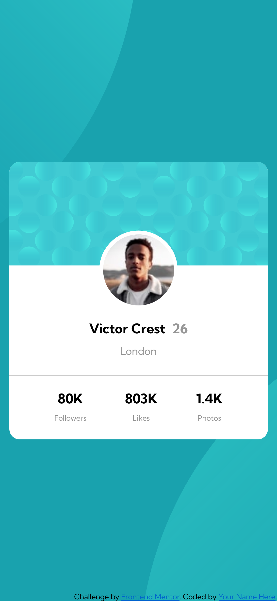
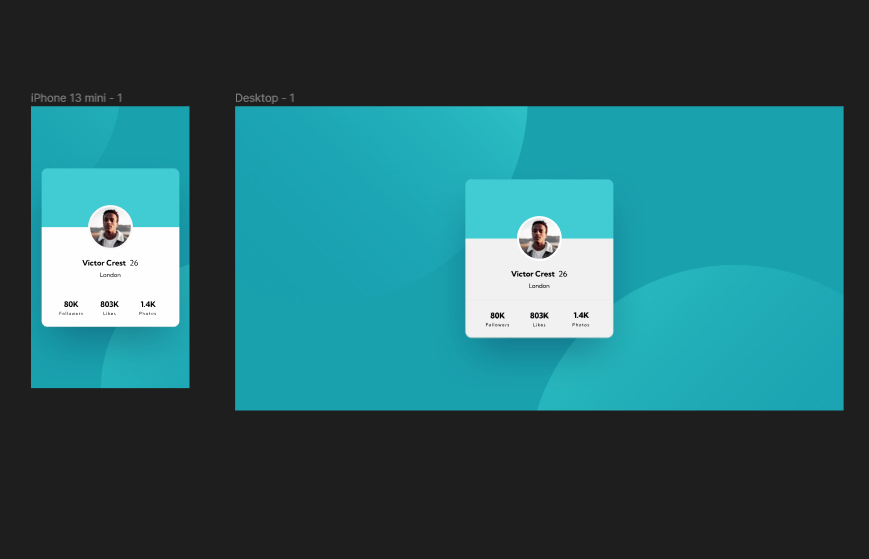

# Frontend Mentor - QR code component solution

This is a solution to the [QR code component challenge on Frontend Mentor](https://www.frontendmentor.io/challenges/qr-code-component-iux_sIO_H). Frontend Mentor challenges help you improve your coding skills by building realistic projects. 

## Table of contents

- [Overview](#overview)
  - [The challenge](#the-challenge)
  - [Screenshot](#screenshot)
  - [Links](#links)
- [My process](#my-process)
  - [Built with](#built-with)
  - [What I learned](#what-i-learned)
  - [Useful resources](#useful-resources)
  - [Author](#author)


## Overview


### The challenge

Users should be able to:

- Build out the project to the designs provided

### Screenshot






### Links

- Solution URL: [Github](https://github.com/AlejandroLaLoggia/profile-card-component)
- Live Site URL: [Github page](https://github.com/AlejandroLaLoggia/)

## My process

Make layout in figma for measure reference, then html and css in mobile-first.

### Built with

- Semantic HTML5 markup
- CSS custom properties
- Flexbox
- Mobile-first workflow
- Figma

### What I learned

Apply two background-image and position them in the same section.

```css
body {
  background-image: url(images/bg-pattern-top.svg),url(images/bg-pattern-bottom.svg);
  background-position-x: right 50vw, 50vw;
  background-position-y: bottom 50vh , 50vh;
}
```


### Useful resources

- [css-tricks]](https://css-tricks.com/)
- [Cómo hacer una TARJETA de Perfil de USUARIO](https://www.youtube.com/watch?v=ooQhAdPQyCI)
- [¿Nivel novato 🤣? Desafío Card con HTML y CSS](https://www.youtube.com/watch?v=Xe_qNR1mmCg)

## Author

- Github Profile - [@AlejandroLaLoggia](https://github.com/AlejandroLaLoggia/)
- Frontend Mentor - [@AlejandroLaLoggia](https://www.frontendmentor.io/profile/AlejandroLaLoggia)


